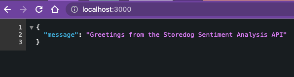
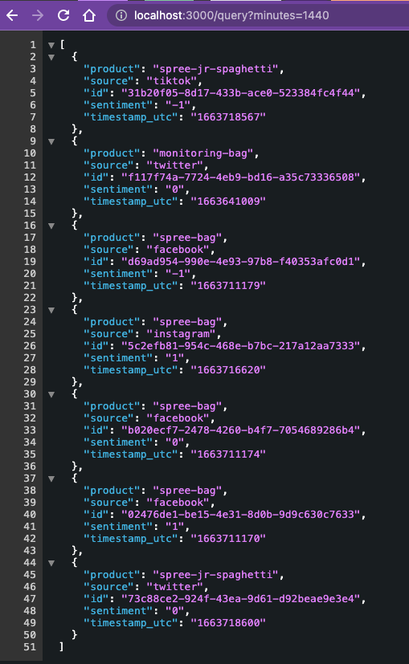
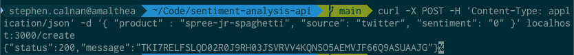

Storedog Sentiment Analysis API
===
This demo application is useful for extending the Storedog infrastructure with a fictional sentiment analysis API. An example narrative is that Storedog has partnered with a service that will measure people's sentiment (bad, neutral, good) about Storedog products when they are mentioned on social media. They will then post results to this API that Storedog has created for them.

You can simulate the partner's service by using a shell script (or node, or python, or whatever) to send random items to the `/create` endpoint, as described below.

You can see the latest sentiment results at the `/query` endpoint.

Requirements
---

- This was tested with node 16 on a Mac. It should run fine on Linux, too.
- An existing DynamoDB table. The app is hardcoded with `storedog-sentiment-v2` in `us-west-2`.
- AWS credentials.

Running
---

Assuming you have a DynamoDB table named `storedog-sentiment-v2` in `us-west-2` (these are currently hardcoded):

```sh
npm install

AWS_ACCESS_KEY_ID=xxxxxxxxxxxxxxxxxxxx \
AWS_SECRET_ACCESS_KEY=xxxxxxxxxxxxxxxxxxxxxxxxxxxxxxxxxxxxxxxx \
npm start
```

It listens on port 3000 by default, and logs to a file `saa.log`. These are configurable in `index.js`

Endpoints
---
The API has three JSON endpoints:

`GET /` 
: displays a welcome message



`GET /query` 
: displays a list of items. You can add the query string `?minutes=10` to get items created in the last 10 minutes. Any number of minutes works.



`POST /create`
: which accepts a JSON payload to create an item.



You can create items like this:

```sh
curl -X POST 
  -H 'Content-Type: application/json' \
  -d '{ "product" : "monitoring-bag", "source": "twitter", "sentiment": "0" }' \
  localhost:3000/create
```

Where `product` is a string representing a storedog product. It can be anything, but the actual products in old storedog are:

- datadog-jr-spaghetti
- spree-jr-spaghetti
- datadog-jr-spaghetti
- datadog-mug
- datadog-stein
- monitoring-stein
- monitoring-mug
- datadog-tote
- datadog-bag
- spree-tote
- spree-bag

`source` can be any string, but is intended to be a social media source:

- facebook
- instagram
- twitter
- tiktock

Sentiment can be any number, but it is intended to be one of:

| value | sentiment |
| --    | --        |
| -1    | bad       |
|  0    | neutral   |
|  1    | positive  |


Logs
---
This app has nice logs.

```json
{"level":30,"time":1663718567116,"pid":62236,"hostname":"amalthea","reqId":"req-4","req":{"method":"POST","url":"/create","hostname":"localhost:3000","remoteAddress":"127.0.0.1","remotePort":60474},"msg":"incoming request"}
{"level":30,"time":1663718567502,"pid":62236,"hostname":"amalthea","reqId":"req-4","res":{"statusCode":200},"responseTime":386.3229390382767,"msg":"request completed"}
{"level":30,"time":1663718600177,"pid":62236,"hostname":"amalthea","reqId":"req-5","req":{"method":"POST","url":"/create","hostname":"localhost:3000","remoteAddress":"127.0.0.1","remotePort":60476},"msg":"incoming request"}
{"level":30,"time":1663718600235,"pid":62236,"hostname":"amalthea","reqId":"req-5","res":{"statusCode":200},"responseTime":58.56933403015137,"msg":"request completed"}
{"level":30,"time":1663718710836,"pid":62236,"hostname":"amalthea","reqId":"req-6","req":{"method":"GET","url":"/query?minutes=1440","hostname":"localhost:3000","remoteAddress":"127.0.0.1","remotePort":60499},"msg":"incoming request"}
{"level":50,"time":1663718711178,"pid":62236,"hostname":"amalthea","msg":"item is invalid: {\"product\":{\"S\":\"monitoring-mug\"},\"id\":{\"S\":\"8254605f-bbd4-4bcf-820f-175a4c88781f\"},\"sentiment\":{\"N\":\"-1\"},\"timestamp_utc\":{\"N\":\"1663638770\"}}"}
{"level":50,"time":1663718711178,"pid":62236,"hostname":"amalthea","msg":"item is invalid: {\"product\":{\"S\":\"monitoring-mug\"},\"id\":{\"S\":\"2af3c6d7-9f22-4c60-9325-71d6d276ef4a\"},\"sentiment\":{\"N\":\"-1\"},\"timestamp_utc\":{\"N\":\"1663638709\"}}"}
{"level":30,"time":1663718711179,"pid":62236,"hostname":"amalthea","reqId":"req-6","res":{"statusCode":200},"responseTime":343.18074691295624,"msg":"request completed"}
```